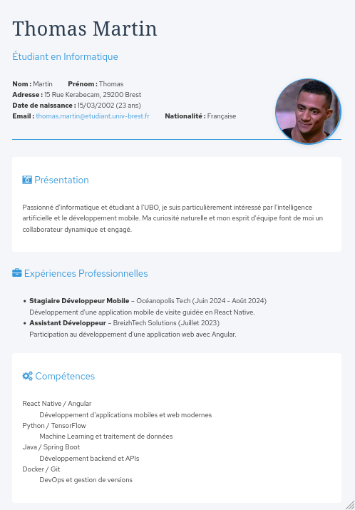

# 🚀 CV en ligne - Mohamed BARBYCH

<div align="center">
  <h1>
    <a href="https://mohamedbarbych.github.io/MonCV/">
      
    </a>
  </h1>

  [](https://mohamedbarbych.github.io/MonCV/)
  [](https://developer.mozilla.org/fr/docs/Web/HTML)
  [](https://developer.mozilla.org/fr/docs/Web/CSS)
  [](https://github.com/MohamedBarbych/MonCV)
</div>

## 📸 Aperçu

<div align="center">
  
  <p><em>Version Desktop du CV</em></p>
  
  
  <p><em>Version Mobile du CV</em></p>
</div>

## 🎯 À propos du projet

Ce CV en ligne a été développé dans le cadre du TP HTML/CSS de l'UE Développement Clients Web à l'Université de Bretagne Occidentale. Il met en œuvre les dernières technologies web et les meilleures pratiques de développement.

## 1. Structure HTML

### 1.1 Structure de base
- Création d'un CV structuré en HTML5
- Organisation en sections distinctes :
  - Header : informations personnelles et photo
  - Présentation
  - Expériences professionnelles
  - Compétences
  - Formation
  - Langues
  - Centres d'intérêt
  - Footer avec liens sociaux

### 1.2 Éléments sémantiques
- Utilisation des balises HTML5 sémantiques (`header`, `main`, `section`, `article`)
- Structure hiérarchique claire avec des titres (`h1`, `h2`, etc.)
- Utilisation appropriée des listes (`ul`, `dl`) pour organiser l'information

## 2. Style CSS

### 2.1 Mise en forme de base
- Création du fichier `resume.css`
- Définition des couleurs principales et variables CSS
- Style du conteneur principal avec largeur maximale et centrage
- Design moderne avec ombres et bordures arrondies

### 2.2 Typographie
- Intégration de la police Adobe Edge Fonts pour le titre principal
- Utilisation de Font Awesome pour les icônes
- Hiérarchie visuelle claire avec différentes tailles de texte

### 2.3 Layout et composants
- Photo de profil avec style distinctif
- Sections bien espacées et visuellement séparées
- Liste de compétences en grille
- Footer avec liens sociaux stylisés

## 3. Mise en ligne

### 3.1 GitHub Pages
- Déploiement automatique via GitHub Actions
- Configuration du workflow dans `.github/workflows/deploy.yml`
- Site accessible à l'adresse : https://mohamedbarbych.github.io/MonCV/

### 3.2 Déploiement automatique
- Configuration des permissions GitHub
- Déploiement automatique à chaque push sur la branche main
- Utilisation des tags pour marquer les versions importantes

## 4. Design Responsive

### 4.1 Media Queries
- Création du fichier `responsive.css`
- Trois breakpoints principaux :
  - 740px : Tablettes et écrans moyens
  - 570px : Petites tablettes
  - 480px : Mobile

### 4.2 Adaptations mobiles
- Passage à une colonne unique sur mobile
- Redimensionnement de la photo de profil
- Centrage des titres
- Adaptation des marges et espacements

## 5. Micro-données

### 5.1 Schema.org
- Intégration des micro-données schema.org/Person
- Balisage sémantique des informations personnelles
- Structure des données pour :
  - Informations personnelles
  - Formation
  - Expérience professionnelle
  - Compétences

### 5.2 SEO
- Amélioration du référencement avec les micro-données
- Données structurées pour une meilleure visibilité dans les moteurs de recherche

## Tags Git

Le projet utilise des tags pour marquer les étapes importantes :
- `Structure` : Structure HTML de base
- `CSS` : Ajout des styles
- `responsive` : Implémentation du design responsive
- `microdata` : Intégration des micro-données

## ✨ Fonctionnalités

### 🏗️ Structure HTML5 Moderne
- Architecture sémantique avec HTML5
- Organisation claire et professionnelle
- Intégration des micro-données Schema.org

### 🎨 Design Responsive
- Adaptation automatique à tous les écrans
- Breakpoints optimisés
- Expérience utilisateur fluide

### 🚀 Déploiement Continu
- Intégration avec GitHub Pages
- Déploiement automatique
- Workflow Git optimisé

## 🛠️ Technologies Utilisées

<div align="center">

| Technologie | Utilisation |
|-------------|-------------|
|  | Structure sémantique |
|  | Styling et animations |
|  | Icônes et symboles |
|  | Hébergement et versioning |

</div>

## 📝 Documentation

### Installation

```bash
# Cloner le repository
git clone https://github.com/MohamedBarbych/MonCV.git

# Accéder au dossier
cd MonCV

# Ouvrir dans VS Code
code .
```

### Structure du Projet

```
MonCV/
├── css/
│   ├── resume.css      # Styles principaux
│   └── responsive.css   # Styles responsives
├── screenshots/        # Captures d'écran
├── index.html         # Page principale
└── README.md         # Documentation
```

## 🌟 Points Forts

- ♿ **Accessibilité** : Respect des normes WCAG
- 📱 **Responsive** : S'adapte à tous les appareils
- 🔍 **SEO** : Optimisé pour les moteurs de recherche
- 🚀 **Performance** : Chargement rapide et optimisé
